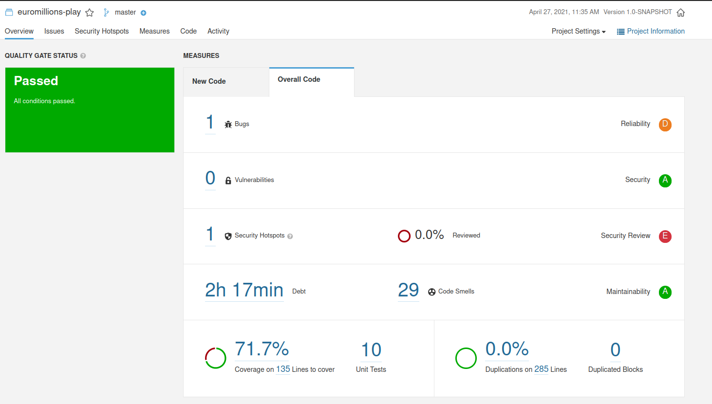
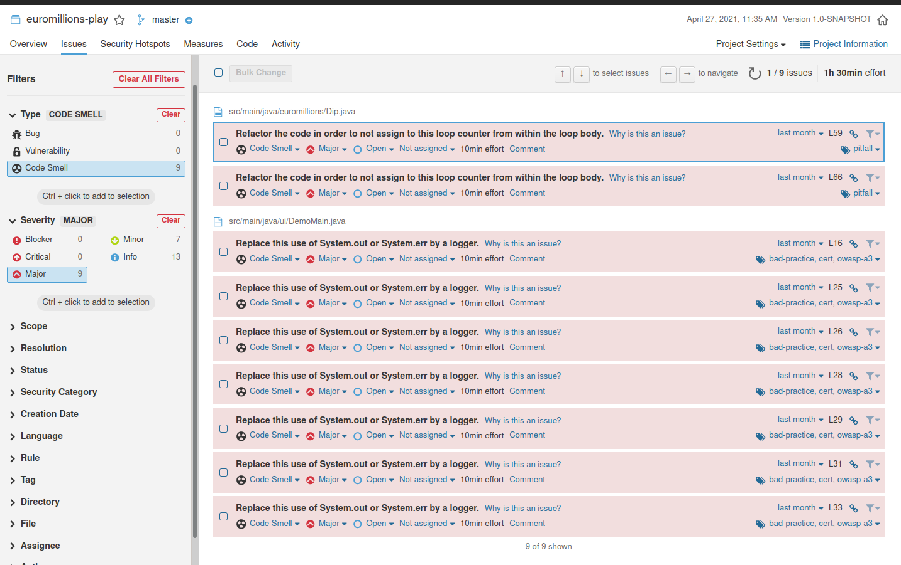
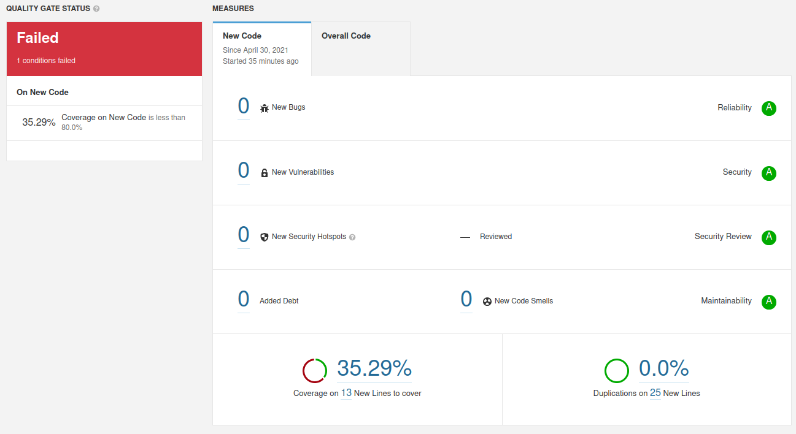
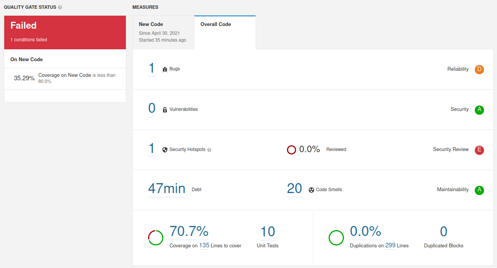
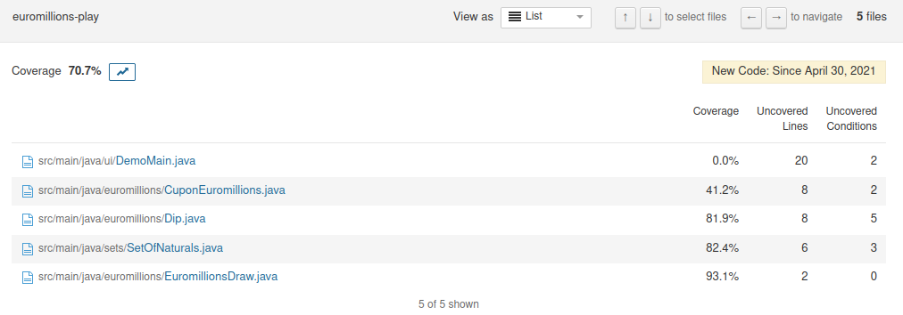
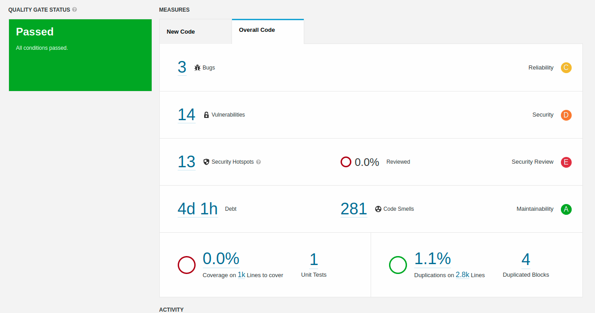
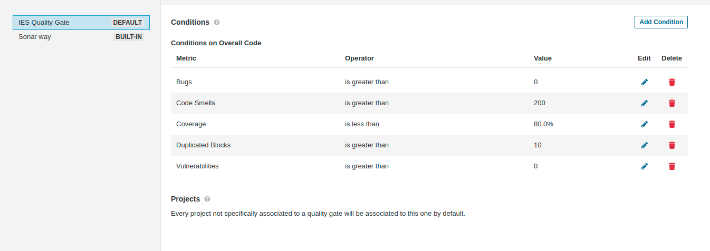
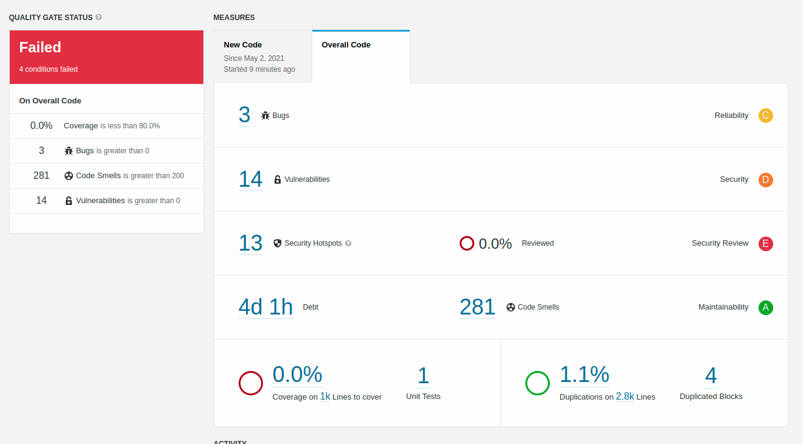

# Static Code Analysis (with Sonar Qube)

## SonarQube

SonarQube is a platform that is used to inspect the quality of the written code of a project, by executing automatic revisions of the code, which are done based on Quality Gates. "Each Quality Gate condition is a combination of:

- a measure
- a comparison operator
- an error value

For instance, a condition might be:

- measure: Blocker issue
- comparison operator: 
- error value: 0"

Taking into account a Maven Project, we can execute the following command to run  the code analysis `$ mvn clean verify sonar:sonar -Dsonar.login=TOKEN `, where `TOKEN`, can be retrieved through the Sonar Qube Dashboard.

### Has your Project Passed the defined Quality Gate? 

Using the project  `P2Euromillions` from the first pratical class,  and running the command mentioned above, when going to the `Sonar Qube` dashboard( http://localhost:9000, locally) we are able to see the results of the report from this tool:

As we are able to see on the left side of the image, the project passed the conditions defined by the quality gate, which, in this case, is was the default quality gate, since every project not specifically associated to a quality gate (like this one) will be associated to the default one. The default quality gate, the "Sonar Way", has a policy of "Clean as you Code", and therefore it only focus, only in new code , and not the overall code. As we haven't added new code to this project yet, it passes the conditions defined. 

By analyzing the results obtained, we can see that some issues have appeared, specially 29 "Code Smells" and one 1 Security Hotspot. Those issues are mentioned, described, and solved  in the table below.

| Issue             |                     Problem Description                      | How to Solve                                                 |
| ----------------- | :----------------------------------------------------------: | ------------------------------------------------------------ |
| Bug               | "Creating a new `Random` object each time a random value is needed is inefficient and may produce numbers which are not random depending on the JDK" | Create a single Random object, then store it, and finally reuse it, so that it is provided better efficiency and randomness. |
| Security HotSpot  | `java.util.Random` provides only pseudorandom number generator, and therefore it should not be used for security Reasons. | Instead of using `java.util.Random`,  making use of `java.security.SecureRandom` |
| Code Smell(Major) |         Loop counter Assignment within the Loop Body         | Simple Refactor, placing the counter in the for-loop declaration |
| Code Smell(Major) |              Use  of System.err  or System.out               | Substitute System.err or System.out declaration for a logger( for example  `log4j2`). |

The details for this issues were gathered taking into account the following image:

###   Run the static analysis and observe/explore the coverage values on the SonarQube dashboard. How many lines are “uncovered”? And how many conditions?

After solving the problems mentioned above, and running again the command, The quality gate defined has now failed

Taking into account the explanation mentioned in the previous point, it is quite clear on why the Project has not passed the defined, and default quality gate: as it will now only take into account the new code, and not the overall, what happens is that the code coverage is over 35.29%, which is obviously less than 80% ( the measure for this condition of the quality gate). In terms of overall code, we are able to check that the coverage of the project is over 70.2%, in which there were **135 lines left to cover**.

Clicking on coverage percentage number, we are redirected to a page where we can see the missing number of conditions (**12 conditions**).

## If possible, collaborate with other colleagues to define a custom quality gate to this project (specially if you are using the IES project, try to work with the development team from then).

In order to conclude the goal of this exercise, we as the team of our IES Project met up, and started by running the previous command, on the project, where we found some security vulnerabilities and a lot of "code smells":

After this, we looked foward to define a quality gate on the overall code:

Finally, after running again the command we got the following results

As it is predictable, the quality gate defined has failed.