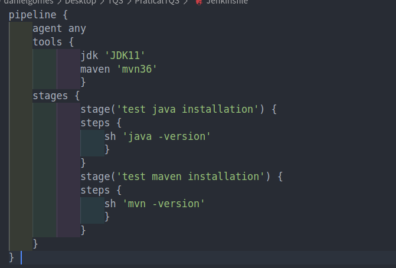
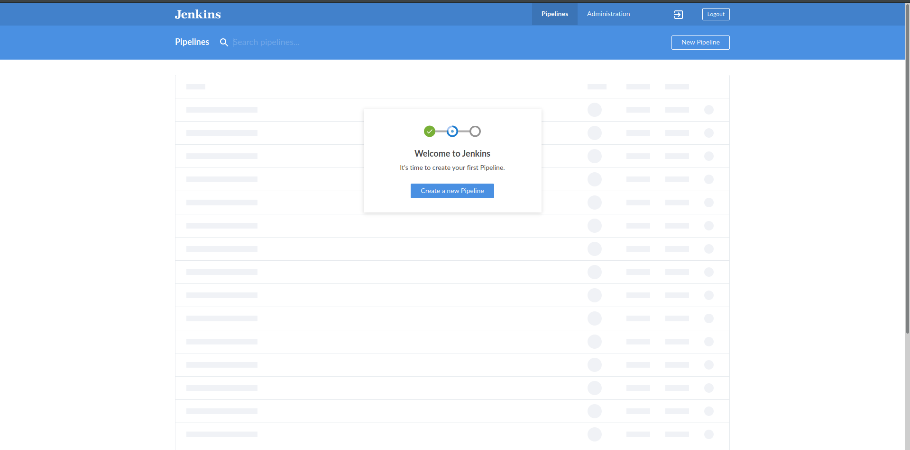

## lab8 - Continuous Integration with Jenkins

Starting by creating a simple Job, that builds the maven project from the `lab1/P2Euromillions` and scheduling a build as it can be seen on the next images:

The build was successful, shown by the following logs of the Job ran: 

After building manually this pipeline, now a pipeline will be scheduled to be ran every 15 minutes, with the help of a `Jenkinsfile`, that tests maven and java installation:

The Build was successful has we may seen:

Nextly, the pipeline was updated to allow not only the testing of java and maven, but also testing the Maven Project:

I had some issues concerning this pipeline, due to missing permission from jenkins to access the files, and therefore in the next image it will be possible to see failed jobs from this pipeline:

After this, a new test with the intent of failed was added so that we could check a pipeline failing, due to failing tests:

Which as we can see, it has failed:

After installing the Blue Ocean plugin on Jenkins, the dashboard contains also the preview done pipelines, on the endpoint `/blue`:

The following image shows the process of creation of the Dashboard, when running Jenkins - Blue Ocean with Docker:

The first pipeline on the repository has failed since the Jenkinsfile created was not using the Docker agent, which has been fixed:

Finally, the pipeline on Docker has been successfully ran:

